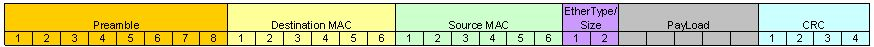

# Ethernet Theory of Operation

## 参考文档

* [AN1120 - Ethernet Theory of Operation](http://ww1.microchip.com/downloads/en/AppNotes/01120a.pdf)
* [以太类型](https://zh.wikipedia.org/wiki/%E4%BB%A5%E5%A4%AA%E7%B1%BB%E5%9E%8B)

## 基本协议结构

## 简要说明

这部分知道有这么一回事就差不多了，一般来说这部分都是由PHY和MAC处理，由硬件自动编解码，如果会出现差错，一般都是硬件电路出现问题，如果要解决硬件电路的差错，一般来说厂家会有标准电路，对照了电路查一下一般能够解决，阻抗匹配的问题有时候也存在。
