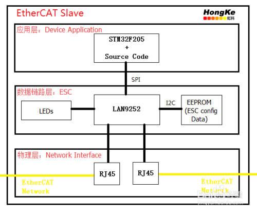
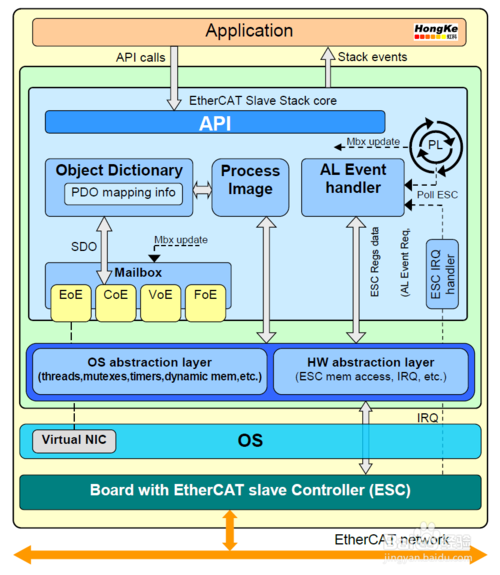

# EtherCAT Base

## 参考文档

* [基于STM32F205及LAN9252的EtherCAT伺服开发](https://jingyan.baidu.com/article/cd4c29790eb928756e6e60c6.html)

## EtherCAT Slave

* ESC：EtherCAT Slave Controller；
* EtherCAT从站是EtherCAT网络非常重要的一部分，其主要组成部分是EtherCAT从站控制器（ESC，EtherCAT Slave Controller）、微处理器以及运行其上的从站软件协议栈。ESC用于EtherCAT数据帧的转发与处理，微处理器及软件协议栈用于实现邮箱数据和过程数据的处理以及控制任务功能；
* 从站控制器ESC多种多样，有Beckhoff的ET1100，ET1200，ET181X；Hilscher的netX50,netX100；Microchip的LAN9252；TI的Sitara AM335X等；

## LAN9252示例

* 微处理器STM32F205通过SPI总线与从站控制器LAN9252通信，EtherCAT协议栈必须移植到STM32F205中；
* 而LAN9252完成数据链路层的工作，并通过I2C接口连接EEPROM，以保存ESC的配置信息；
* 底层的PHY芯片，RJ45等完成物理层的工作，且PHY芯片也是LAN9252自带的；

如上可知：

* EtherCAT Slave控制器是用于接收EtherCAT网络数据的，其本质相当于I2C Slave控制器；
* 我们常说的EtherCAT协议，是和I2C Slave通信之后的除去地址部分以后的data传输的数据协议，可以认为是CAN通信中8字节的数据格式协议，也就是相当于CANOpen协议了，所以个人认为EtherCAT协议EtherCAT控制器接收、发送数据之后的数据编解码协议，这个编解码协议是已经公开、定好的协议；
* EtherCAT ECS只要有相应的PHY就行了，那么不同的单片机就变成了需要移植对应的EtherCAT编解码协议，当然也包括了和EtherCAT ECS通信的那部分通信代码；

## EtherCAT从站协议

* 德国KPA公司的EtherCAT从站协议栈包含完整的源代码，以及四个针对硬件平台的样例工程，即STM32F407，DSP28335，TI Sitara系列以及赛灵思FPGA的uBlaze软核；
* KPA EtherCAT从站协议栈结构框架如下图所示：  
  
  * Application部分为用户的应用部分，只需要调用协议栈的API函数即可实现EtherCAT通信；
  * EtherCAT Slave Stack core是源代码部分，用户不需要做任何的修改，只需要调用其丰富的API函数即可；
  * 而EtherCAT Slave Stack core与ESC之间的通信已经由源代码实现了，用户只需适配好PDI通道如SPI即可；

# EtherCAT Slave Stack Code (SSC)

https://www.ethercat.org/cn/products/54FA3235E29643BC805BDD807DF199DE.htm

貌似一般人不能直接下载到源代码，要是ETG members才能直接下载到源代码和相关文档。

