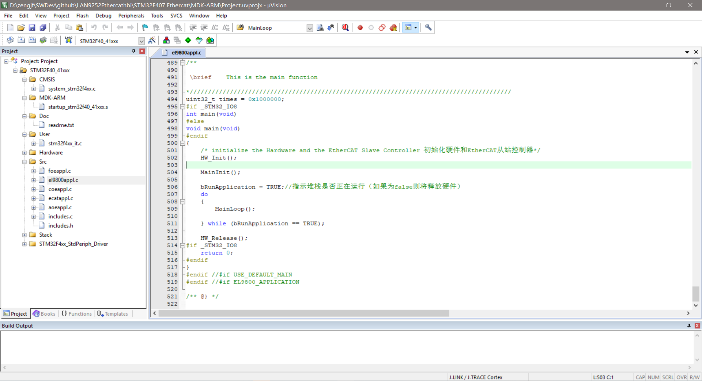
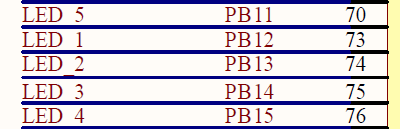
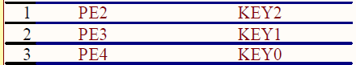
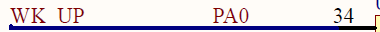
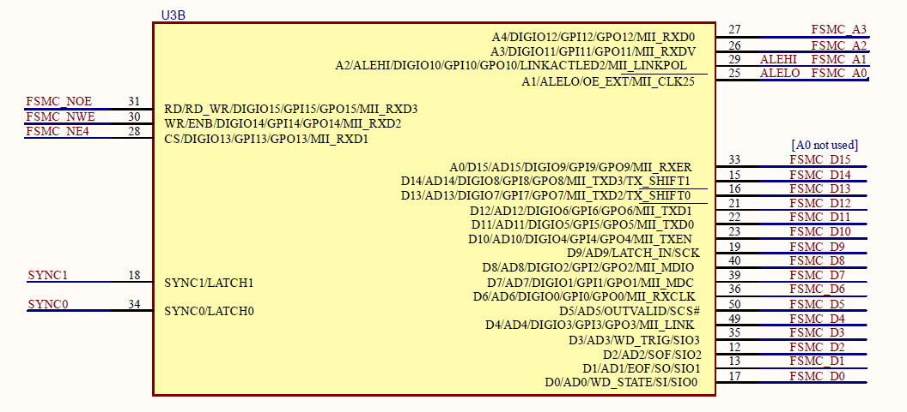
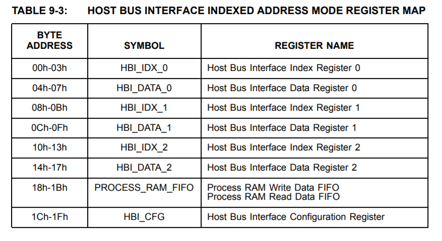
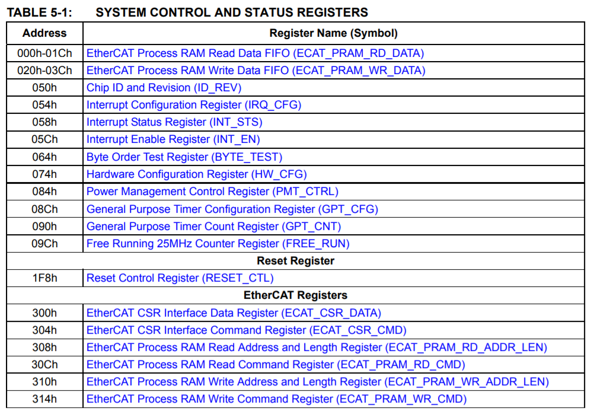

# STM32F407 EtherCAT Project Base

## 原理图

[EtherCAT_Schematic.pdf](./refers/EtherCAT_Schematic.pdf)

## Project View



## LED & Key

  
  



```C
void GPIO_Config(void) 
{ 
  GPIO_InitTypeDef GPIO_InitStructure;

  RCC_AHB1PeriphClockCmd(RCC_AHB1Periph_GPIOA | RCC_AHB1Periph_GPIOB | RCC_AHB1Periph_GPIOE, ENABLE);

  //----------------------------------------------------------------led
  GPIO_InitStructure.GPIO_Pin = GPIO_Pin_11 | GPIO_Pin_12 | GPIO_Pin_13 | GPIO_Pin_14 | GPIO_Pin_15;
  GPIO_InitStructure.GPIO_Mode = GPIO_Mode_OUT;
  GPIO_InitStructure.GPIO_OType = GPIO_OType_PP;
  GPIO_InitStructure.GPIO_Speed = GPIO_Speed_50MHz;
  GPIO_InitStructure.GPIO_PuPd = GPIO_PuPd_NOPULL;
  GPIO_Init(GPIOB, &GPIO_InitStructure);
  GPIO_SetBits(GPIOB, GPIO_Pin_11 | GPIO_Pin_12 | GPIO_Pin_13 | GPIO_Pin_14 | GPIO_Pin_15);
    
 
  //-----------------------------------------------------------------key
  GPIO_InitStructure.GPIO_Pin = GPIO_Pin_0;// KEY1
  GPIO_InitStructure.GPIO_Mode = GPIO_Mode_IN;
  GPIO_InitStructure.GPIO_Speed = GPIO_Speed_50MHz;
  GPIO_InitStructure.GPIO_PuPd = GPIO_PuPd_DOWN ;
  GPIO_Init(GPIOA, &GPIO_InitStructure);
    
  GPIO_InitStructure.GPIO_Pin = GPIO_Pin_2 | GPIO_Pin_3 | GPIO_Pin_4;// KEY2
  GPIO_InitStructure.GPIO_Mode = GPIO_Mode_IN;
  GPIO_InitStructure.GPIO_Speed = GPIO_Speed_50MHz;
  GPIO_InitStructure.GPIO_PuPd = GPIO_PuPd_UP ;
  GPIO_Init(GPIOE, &GPIO_InitStructure);
    
}  
```

## FSMC



### 参考文档

* [STM32外扩SRAM](http://www.cnblogs.com/zpehome/p/3477011.html)
* [STM32探秘 之FSMC](https://blog.csdn.net/wisepragma/article/details/51622606)
* [STM32 FSMC学习笔记](https://www.cnblogs.com/hduxyc/archive/2011/05/17/2048099.html)

### 引脚说明

* FSMC_D[16:0]：16bit的数据总线；
* FSMC NEx：分配给NOR的256M，再分为4个区，每个区用来分配一个外设，这四个外设的片选分为是NE1-NE4，对应的引脚为：PD7-NE1，PG9-NE2，PG10-NE3，PG12-NE4，这里选择NE4作为CS引脚；
* FSMC NOE：输出使能，连接LAN9252的RD脚。
* FSMC NWE：写使能，连接LAN9252的RW脚。
* FSMC Ax：用在LAN9252显示RAM和寄存器之间进行选择的地址线，即该线用于选择LAN9252的RS脚，该线可用地址线的任意一根线，范围：FSMC_A[25:0]。目前我们只用到了4根地址线；

### LAN9252

* PDI(Process Data Interface 或者 Physical Device Interface)；
* HBI(Host Bus Interface)由`PDI_SELECT`寄存器进行进行模式选择，HBI接口主要是在英文数据手册的62页；
* 目前使用的是变址地址模式，参考英文数据手册82页；
  * 采用16bit模式，所以最低位不用地址，默认为0：  
    
  * 有三个变址寄存器是为了多线程操作，如果没必要用一个就行了；
  * 寄存器地址：  
    
* `PDI_SELECT`由EEPROM进行配置的，相关信息在英文数据手册的296页；
* [LAN9252_Datasheet_中文版.pdf](./refers/LAN9252_Datasheet_CN.pdf)

