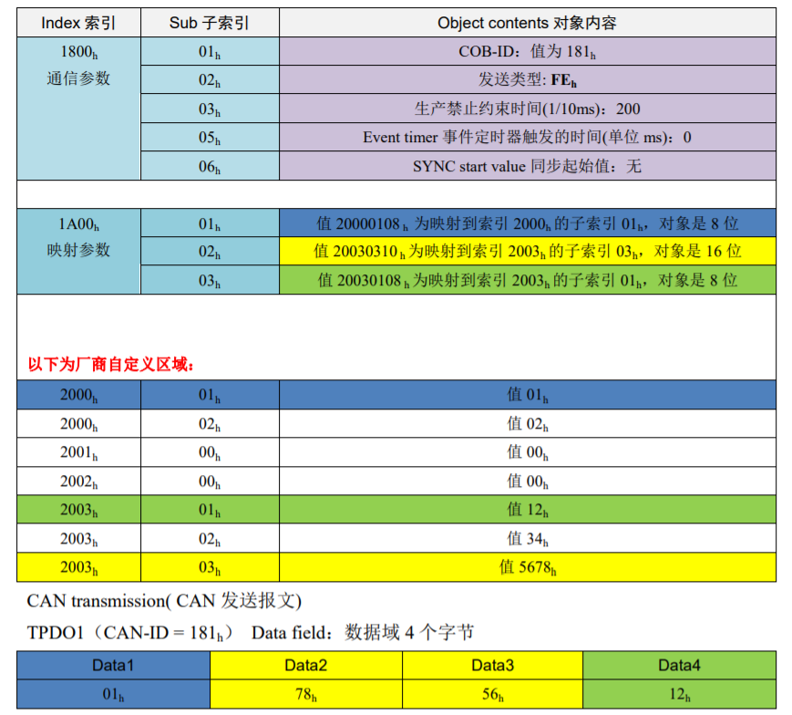
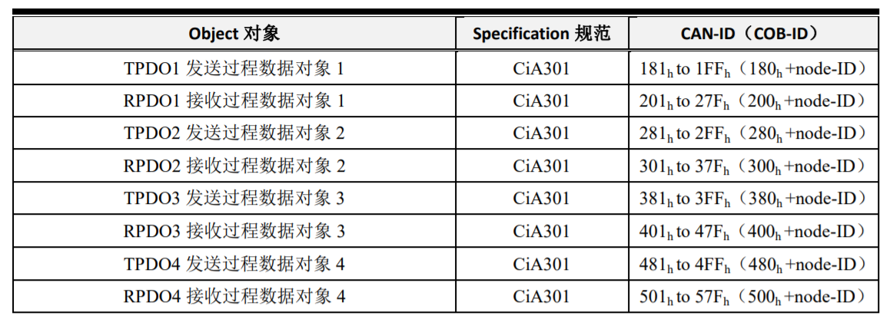

# CoE Object Dictionary

## 参考文档

* [301 CANopen_easy_begin.pdf](./refers/CANopen_easy_begin.pdf)：主要阅读第5章；
* [CanOpen_DS402_Protocol.pdf](./refers/CanOpen_DS402_Protocol.pdf)
* [请问EtherCAT和CANopen之间有什么关系？](https://www.zhihu.com/question/40947468)

## 对象字典

* 扩展出来相当于是多维数组；
* COB-ID：Communication Object Identifier,即 CANopen中对某种通讯对象的报文帧ID，即CAN报文的11位ID。代表了一种通讯含义。
* Node-ID：节点ID号，即CANopen网络中的节点地址，CANopen规定了逻辑上最
大 128 个节点，所以 Node-ID 最大为 128（7 位）。
* PDO：  
  
  * RPDO Index `1400h ~ 15FFh`, 映射参数Index `1600h ~ 17FFh`，数据存放在 `2000h` 之后的自定义区；
  * TPDO Index `1800h ~ 19FFh`，映射参数Index `1A00h ~ 1BFFh`，数据存放在 `2000h` 之后的自定义区；
  * PDO Index和映射参数Index是一一对应的，固定死的，PDO Index的子索引表示的是当前PDO的一些属性，映射参数的子索引表示的是PDO接收、发送的数据在2000h之后的位置、字节长度等信息；
  * 由上可知，TPDO/RPDO可以有0x1FF（512）个；
  * PDO的COB-ID：发送/接收这个PDO的帧ID，就是4组发送/接收PDO的任意一组中的对应的那个ID；  
    
* SDO：
  * SDO主要用于CANopen主站对从节点的参数配置。服务确认是SDO的最大的特点，为每个消息都生成一个应答，确保数据传输的准确性。

## 402 对象字典示例

* 对象结构体
  ```C
  /**
   * \brief Object dictionary entry structure
   */
  typedef struct OBJ_ENTRY
  {
      struct OBJ_ENTRY                      *pPrev; /**< \brief Previous entry(object) in the object dictionary list*/
      struct OBJ_ENTRY                      *pNext; /**< \brief Next entry(object) in the object dictionary list*/
  
      UINT16                                Index; /**< \brief Object index*/
      TSDOINFOOBJDESC                       ObjDesc; /**< \brief Object access, type and code*/
      OBJCONST TSDOINFOENTRYDESC OBJMEM     *pEntryDesc; /**< \brief pointer to object entry descriptions*/
      OBJCONST UCHAR OBJMEM                 *pName; /**< \brief Pointer to object and entry names*/
      void MBXMEM                           *pVarPtr; /**< \brief Pointer to object buffer*/
      UINT8 (* Read)( UINT16 Index, UINT8 Subindex, UINT32 Size, UINT16 MBXMEM * pData, UINT8 bCompleteAccess ); /**< \brief Function pointer to read function (if NULL default read function will be used)*/
      UINT8 (* Write)( UINT16 Index, UINT8 Subindex, UINT32 Size, UINT16 MBXMEM * pData, UINT8 bCompleteAccess ); /**< \brief Function pointer to write function (if NULL default write function will be used)*/
      UINT16                                 NonVolatileOffset; /**< \brief Offset within the non volatile memory (need to be defined for backup objects)*/
  }
  TOBJECT;
  ```
* 对象字典实例
  ```C
  /******************************************************************************
  ** Object Dictionary
  ******************************************************************************/
  /**
   * \brief Object dictionary pointer
   */
  TOBJECT    OBJMEM * ObjDicList = NULL;
  
  /**
   * \brief List of generic application independent objects
   */
  TOBJECT    OBJMEM GenObjDic[] = {
      /* Object 0x1000 */
     {NULL,NULL,  0x1000, {DEFTYPE_UNSIGNED32, 0 | (OBJCODE_VAR << 8)}, &sEntryDesc0x1000, aName0x1000, &u32Devicetype, NULL, NULL, 0x0000 },
     /* Object 0x1001 */
     {NULL,NULL,  0x1001, {DEFTYPE_UNSIGNED8, 0 | (OBJCODE_VAR << 8)}, &sEntryDesc0x1001, aName0x1001, &u16ErrorRegister, NULL, NULL, 0x0000 },
  /* Object 0x1008 */
     {NULL,NULL,  0x1008, {DEFTYPE_VISIBLESTRING, 0 | (OBJCODE_VAR << 8)}, &sEntryDesc0x1008, aName0x1008, acDevicename, NULL, NULL, 0x0000 },
     /* Object 0x1009 */
     {NULL,NULL,  0x1009, {DEFTYPE_VISIBLESTRING, 0 | (OBJCODE_VAR << 8)}, &sEntryDesc0x1009, aName0x1009, acHardwareversion, NULL, NULL, 0x0000 },
     /* Object 0x100A */
     {NULL,NULL,  0x100A, {DEFTYPE_VISIBLESTRING, 0 | (OBJCODE_VAR << 8)}, &sEntryDesc0x100A, aName0x100A, acSoftwareversion, NULL, NULL, 0x0000 },
     /* Object 0x1018 */
     {NULL,NULL,  0x1018, {DEFTYPE_IDENTITY, 4 | (OBJCODE_REC << 8)}, asEntryDesc0x1018, aName0x1018, &sIdentity, NULL, NULL, 0x0000 },
      /* Object 0x10F1 */
     {NULL,NULL,  0x10F1, {DEFTYPE_RECORD, 2 | (OBJCODE_REC << 8)}, asEntryDesc0x10F1, aName0x10F1, &sErrorSettings, NULL, NULL, 0x0000 },
     /* Object 0x1C00 */
     {NULL,NULL, 0x1C00, {DEFTYPE_UNSIGNED8, 4 | (OBJCODE_ARR << 8)}, asEntryDesc0x1C00, aName0x1C00, &sSyncmanagertype, NULL, NULL, 0x0000 },
     /* Object 0x1C32 */
     {NULL,NULL, 0x1C32, {DEFTYPE_SMPAR, 32 | (OBJCODE_REC << 8)}, asEntryDesc0x1C3x, aName0x1C32, &sSyncManOutPar, NULL, NULL, 0x0000 },
     /* Object 0x1C33 */
     {NULL,NULL, 0x1C33, {DEFTYPE_SMPAR, 32 | (OBJCODE_REC << 8)}, asEntryDesc0x1C3x, aName0x1C33, &sSyncManInPar, NULL, NULL, 0x0000 },
     
    /*end of entries*/
  /*ECATCHANGE_START(V5.11) COE1*/
    {NULL,NULL, 0xFFFF, {0, 0}, NULL, NULL, NULL, NULL, NULL, 0x000}};
  /*ECATCHANGE_END(V5.11) COE1*/
  ```
* Index为``0x1C33``的子索引表达方式：
  ```C
  /*---------------------------------------------
  -    0x1C3x
  -----------------------------------------------*/
  /**
   * \brief 0x1C3x (SyncManager parameter) entry description
   *
   * The entry descriptions are used for 0x1C32 and 0x1C33
   */
  OBJCONST TSDOINFOENTRYDESC    OBJMEM asEntryDesc0x1C3x[] = {
     {DEFTYPE_UNSIGNED8, 0x8, ACCESS_READ }, /* Subindex 000 */
     {DEFTYPE_UNSIGNED16, 0x10, (ACCESS_READ | ACCESS_WRITE_PREOP)}, /* SubIndex 001: Synchronization Type */
     {DEFTYPE_UNSIGNED32, 0x20, ACCESS_READ}, /* SubIndex 002: Cycle Time */
     {0x0000, 0x20, 0}, /* SubIndex 003: Shift Time (not supported)*/
     {DEFTYPE_UNSIGNED16, 0x10, ACCESS_READ}, /* SubIndex 004: Synchronization Types supported */
     {DEFTYPE_UNSIGNED32, 0x20, ACCESS_READ}, /* SubIndex 005: Minimum Cycle Time */
     {DEFTYPE_UNSIGNED32, 0x20, ACCESS_READ}, /* SubIndex 006: Calc and Copy Time */
     {0x0000, 0x20, 0}, /* Subindex 007 Minimum Delay Time (not supported)*/
     {DEFTYPE_UNSIGNED16, 0x10, ACCESS_READWRITE}, /* SubIndex 008: Get Cycle Time */
     {DEFTYPE_UNSIGNED32, 0x20, ACCESS_READ}, /* SubIndex 009: Delay Time */
     {DEFTYPE_UNSIGNED32, 0x20, ACCESS_READWRITE}, /* SubIndex 010: Sync0 Cycle Time */
     {DEFTYPE_UNSIGNED16, 0x10, ACCESS_READ}, /* SubIndex 011: SM-Event Missed */
     {DEFTYPE_UNSIGNED16, 0x10, ACCESS_READ}, /* SubIndex 012: Cycle Time Too Small */
     {0x0000, 0x10, 0}, /* SubIndex 013: Shift Too Short Counter (not supported)*/
     {0x0000, 0x10, 0}, /* Subindex 014: RxPDO Toggle Failed (not supported)*/
     {0x0000, 0x20, 0}, /* Subindex 015: Minimum Cycle Distance (not supported)*/
     {0x0000, 0x20, 0}, /* Subindex 016: Maximum Cycle Distance (not supported)*/
     {0x0000, 0x20, 0}, /* Subindex 017: Minimum SM Sync Distance (not supported)*/
     {0x0000, 0x20, 0}, /* Subindex 018: Maximum SM Sync Distance (not supported)*/
     {0x0000, 0, 0}, /* Subindex 019 doesn't exist */
     {0x0000, 0, 0}, /* Subindex 020 doesn't exist */
     {0x0000, 0, 0}, /* Subindex 021 doesn't exist */
     {0x0000, 0, 0}, /* Subindex 022 doesn't exist */
     {0x0000, 0, 0}, /* Subindex 023 doesn't exist */
     {0x0000, 0, 0}, /* Subindex 024 doesn't exist */
     {0x0000, 0, 0}, /* Subindex 025 doesn't exist */
     {0x0000, 0, 0}, /* Subindex 026 doesn't exist */
     {0x0000, 0, 0}, /* Subindex 027 doesn't exist */
     {0x0000, 0, 0}, /* Subindex 028 doesn't exist */
     {0x0000, 0, 0}, /* Subindex 029 doesn't exist */
     {0x0000, 0, 0}, /* Subindex 030 doesn't exist */
     {0x0000, 0, 0}, /* Subindex 031 doesn't exist */
     {DEFTYPE_BOOLEAN, 0x01, ACCESS_READ}}; /* SubIndex 032: Sync error */
  ```
