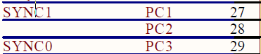

# LED Project Base Hacking

## EtherCAT Slave配置文件

ecat_def.h

## Object Dictionary

```C
/******************************************************************************
** Object Dictionary
******************************************************************************/
/**
 * \brief Object dictionary pointer
 */
TOBJECT    OBJMEM * ObjDicList = NULL;

/**
 * \brief List of generic application independent objects
 */
TOBJECT    OBJMEM GenObjDic[] = {
    /* Object 0x1000 */
   {NULL,NULL,  0x1000, {DEFTYPE_UNSIGNED32, 0 | (OBJCODE_VAR << 8)}, &sEntryDesc0x1000, aName0x1000, &u32Devicetype, NULL, NULL, 0x0000 },
   /* Object 0x1001 */
   {NULL,NULL,  0x1001, {DEFTYPE_UNSIGNED8, 0 | (OBJCODE_VAR << 8)}, &sEntryDesc0x1001, aName0x1001, &u16ErrorRegister, NULL, NULL, 0x0000 },
/* Object 0x1008 */
   {NULL,NULL,  0x1008, {DEFTYPE_VISIBLESTRING, 0 | (OBJCODE_VAR << 8)}, &sEntryDesc0x1008, aName0x1008, acDevicename, NULL, NULL, 0x0000 },
   /* Object 0x1009 */
   {NULL,NULL,  0x1009, {DEFTYPE_VISIBLESTRING, 0 | (OBJCODE_VAR << 8)}, &sEntryDesc0x1009, aName0x1009, acHardwareversion, NULL, NULL, 0x0000 },
   /* Object 0x100A */
   {NULL,NULL,  0x100A, {DEFTYPE_VISIBLESTRING, 0 | (OBJCODE_VAR << 8)}, &sEntryDesc0x100A, aName0x100A, acSoftwareversion, NULL, NULL, 0x0000 },
   /* Object 0x1018 */
   {NULL,NULL,  0x1018, {DEFTYPE_IDENTITY, 4 | (OBJCODE_REC << 8)}, asEntryDesc0x1018, aName0x1018, &sIdentity, NULL, NULL, 0x0000 },
    /* Object 0x10F1 */
   {NULL,NULL,  0x10F1, {DEFTYPE_RECORD, 2 | (OBJCODE_REC << 8)}, asEntryDesc0x10F1, aName0x10F1, &sErrorSettings, NULL, NULL, 0x0000 },
   /* Object 0x1C00 */
   {NULL,NULL, 0x1C00, {DEFTYPE_UNSIGNED8, 4 | (OBJCODE_ARR << 8)}, asEntryDesc0x1C00, aName0x1C00, &sSyncmanagertype, NULL, NULL, 0x0000 },
   /* Object 0x1C32 */
   {NULL,NULL, 0x1C32, {DEFTYPE_SMPAR, 32 | (OBJCODE_REC << 8)}, asEntryDesc0x1C3x, aName0x1C32, &sSyncManOutPar, NULL, NULL, 0x0000 },
   /* Object 0x1C33 */
   {NULL,NULL, 0x1C33, {DEFTYPE_SMPAR, 32 | (OBJCODE_REC << 8)}, asEntryDesc0x1C3x, aName0x1C33, &sSyncManInPar, NULL, NULL, 0x0000 },
   
  /*end of entries*/
/*ECATCHANGE_START(V5.11) COE1*/
  {NULL,NULL, 0xFFFF, {0, 0}, NULL, NULL, NULL, NULL, NULL, 0x000}};
/*ECATCHANGE_END(V5.11) COE1*/
```

## Functions

* void main(void): el9800appl.c
  * HW_Init()
    * GPIO_Config(): 初始化LED、按键引脚功能，el9800hw.c;
    * FSMC_GPIO_Init(): 初始化HBI接口引脚功能，目前使用变址寻址，el9800hw.c;
    * INIT_ESC_INT: **初始化LAN9252 PDI中断引脚**，是一个宏定义；
      * void EXTI0_Configuration(void)
    * INIT_SYNC0_INT: **初始化LAN9252 SYNC0中断引脚**，是一个宏定义；
    * INIT_SYNC1_INT: **初始化LAN9252 SYNC1中断引脚**，是一个宏定义；
  * MainInit()
    * ECAT_Init(): ecatslv.c;
      * MBX_Init()
      * COE_Init()
    * COE_ObjInit(): 初始化对象字典，coeappl.c;
      * COE_ObjDictionaryInit(): 初始化对象字典，coeappl.c;
        * AddObjectsToObjDictionary((TOBJECT OBJMEM *) GenObjDic): 将对象添加进入对象字典，coeappl.c;
          * COE_AddObjectToDic(pEntry): 将对象添加到字典，coeappl.c;
  * MainLoop()
    * ECAT_Application();
      * APPL_Application(): **LED灯状态设定和按键的获取处理**;
    * ECAT_Main(): ecatslv.c;
      * void AL_ControlInd(UINT8 alControl, UINT16 alStatusCode)
        * APPL_GenerateMapping(&nPdInputSize,&nPdOutputSize)
        * APPL_StartMailboxHandler()
        * APPL_StopMailboxHandler()
        * APPL_StartInputHandler(&u16ALEventMask)
        * APPL_StopInputHandler()
        * APPL_AckErrorInd(stateTrans)
    * COE_Main(): pSdoPendFunc在目前的软件里面没有设定read/write函数，所以这个函数里面的逻辑貌似不会被处理，coeappl.c;
  * HW_Release()

## EtherCAT PDI中断


* 中断相关处理函数宏定义
  ```C
  /*-----------------------------------------------------------------------------------------
  ------
  ------    ESC Interrupt
  ------
  -----------------------------------------------------------------------------------------*/
  #if AL_EVENT_ENABLED
  #define    INIT_ESC_INT           EXTI0_Configuration();					
  #define    EcatIsr                EXTI0_IRQHandler
  #define    ACK_ESC_INT         		EXTI_ClearITPendingBit(EXTI_Line0);  
  #define IS_ESC_INT_ACTIVE					((GPIO_ReadInputDataBit(GPIOC,GPIO_Pin_0)) == 0) 
  #endif //#if AL_EVENT_ENABLED
  ```
* 中断处理函数  
  `#define    EcatIsr                EXTI0_IRQHandler`
  * PDI_Isr(): PDI数据处理中断；
  * ACK_ESC_INT: 宏定义；
    * EXTI_ClearITPendingBit(EXTI_Line0)

## EtherCAT SYNC中断



* 中断相关处理函数宏定义
  ```C
  /*-----------------------------------------------------------------------------------------
  ------
  ------    SYNC0 Interrupt
  ------
  -----------------------------------------------------------------------------------------*/
  #if DC_SUPPORTED && _STM32_IO8
  #define    INIT_SYNC0_INT                  EXTI1_Configuration();		
  #define    Sync0Isr                        				EXTI3_IRQHandler 
  #define    DISABLE_SYNC0_INT             NVIC_DisableIRQ(EXTI3_IRQn);	 
  #define    ENABLE_SYNC0_INT               NVIC_EnableIRQ(EXTI3_IRQn);	
  #define    ACK_SYNC0_INT                  EXTI_ClearITPendingBit(EXTI_Line3);
  #define    IS_SYNC0_INT_ACTIVE              ((GPIO_ReadInputDataBit(GPIOC,GPIO_Pin_3)) == 0) 
  																					
  /*ECATCHANGE_START(V5.10) HW3*/
  
  #define    INIT_SYNC1_INT                  EXTI2_Configuration();
  #define    Sync1Isr                        		EXTI1_IRQHandler
  #define    DISABLE_SYNC1_INT                 NVIC_DisableIRQ(EXTI1_IRQn);
  #define    ENABLE_SYNC1_INT                 NVIC_EnableIRQ(EXTI1_IRQn); 
  #define    ACK_SYNC1_INT                  	 EXTI_ClearITPendingBit(EXTI_Line1);
  #define    IS_SYNC1_INT_ACTIVE              ((GPIO_ReadInputDataBit(GPIOC,GPIO_Pin_1)) == 0) 
  
  /*ECATCHANGE_END(V5.10) HW3*/
  ```
* 中断处理函数  
  `#define    Sync0Isr                        	EXTI3_IRQHandler`  
  `#define    Sync1Isr                        	EXTI1_IRQHandler`
