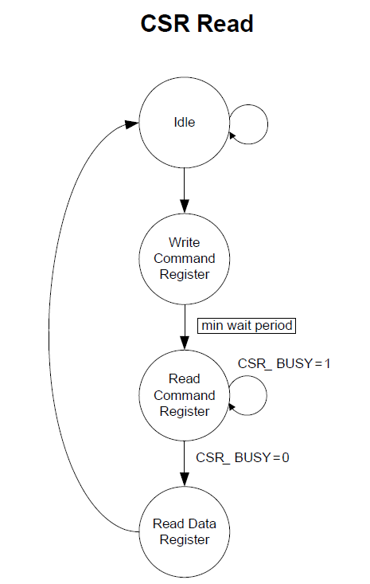
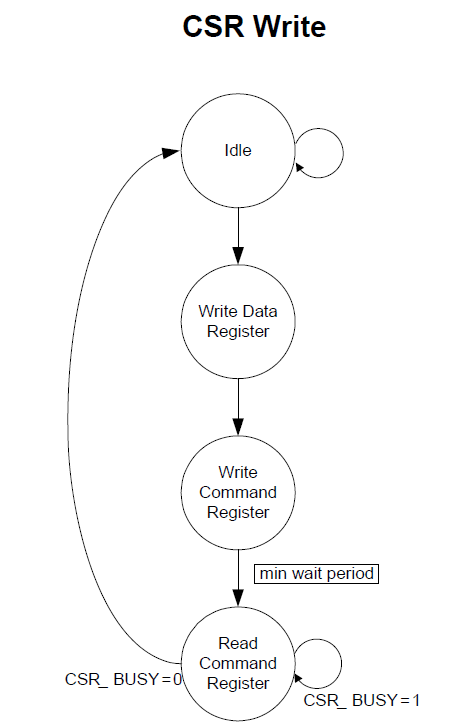

# EtherCAT CSR And Process Data RAM Access

## 参考数据手册：

* 12.11 EtherCAT CSR and Process Data RAM Access：寄存器间接寄存器访问操作方法
* 12.13 EtherCAT CSR and Process Data RAM Access Registers (Directly Addressable)：寄存器访问间接寄存器
* 12.14 EtherCAT Core CSR Registers (Indirectly Addressable)：CSR内部寄存器

## CSR地址空间

由数据手册223页开始的CSR寄存器可以知道，地址空间没有超过16bit；

## EEPROM

前面有说，不知道怎么在STM32中获取EEPROM中的数据，数据手册224页，EEPROM Interface部分由相关寄存器描述；

## CSR寄存器读



```C
void PMPReadRegUsingCSR(UINT8 *ReadBuffer, UINT16 Address, UINT8 Count)
{
    UINT32_VAL param32_1 = {0};
    UINT8 i = 0;
    UINT16_VAL wAddr;
    wAddr.Val = Address;

    param32_1.v[0] = wAddr.byte.LB;
    param32_1.v[1] = wAddr.byte.HB;
    param32_1.v[2] = Count;
    param32_1.v[3] = ESC_READ_BYTE;

    PMPWriteDWord (CSR_CMD_REG, param32_1.Val);

    do
    {
        param32_1.Val = PMPReadDWord (ESC_CSR_CMD_REG);
    }while(param32_1.v[3] & ESC_CSR_BUSY);

    param32_1.Val = PMPReadDWord (ESC_CSR_DATA_REG);
    
    for(i=0;i<Count;i++)
        ReadBuffer[i] = param32_1.v[i];
   
    return;
}
```

## CSR寄存器写



```C
void PMPWriteRegUsingCSR( UINT8 *WriteBuffer, UINT16 Address, UINT8 Count)
{
    UINT32_VAL param32_1 = {0};
    UINT16_VAL wAddr;
    UINT8 i = 0;
        
    for(i=0;i<Count;i++)
        param32_1.v[i] = WriteBuffer[i];
        
    PMPWriteDWord (ESC_CSR_DATA_REG, param32_1.Val);
        
    wAddr.Val = Address;

    param32_1.v[0] = wAddr.byte.LB;
    param32_1.v[1] = wAddr.byte.HB;
    param32_1.v[2] = Count;
    param32_1.v[3] = ESC_WRITE_BYTE;

    PMPWriteDWord (0x304, param32_1.Val);
    do
    {
        param32_1.Val = PMPReadDWord (0x304);
    }while(param32_1.v[3] & ESC_CSR_BUSY);

    return;
}
```

## ETHERCAT PROCESS RAM

* 跟一下这部分代码就行了，处理过程数据手册上都有写；
* 这段代码目前还没搞懂什么意思，这个宏个人理解应该是`0x00`，而不是`0x04`：
  ```C
  /*Fifo registers are aliased address. In indexed it will read indexed data reg 0x04, but it will point to reg 0
   In other modes read 0x04 FIFO register since all registers are aliased*/
  // #define PRAM_READ_FIFO_REG              0x04
  param32_1.Val = PMPReadDWord (PRAM_READ_FIFO_REG);
  ```
