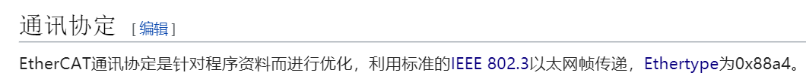
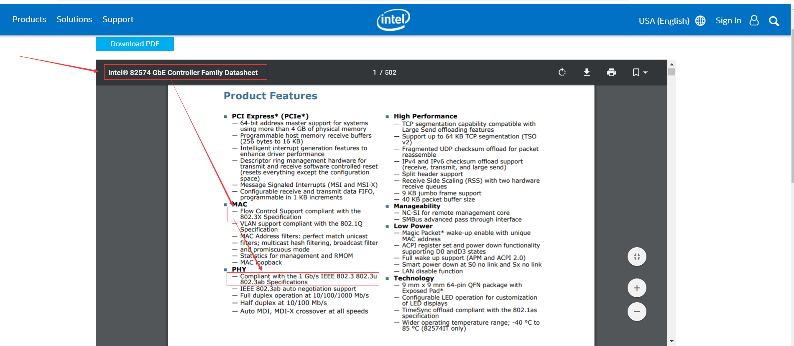

# EtherCAT Host

## 参考文档

* [EtherCAT](https://zh.wikipedia.org/wiki/EtherCAT)
* [EtherCAT主站对PHY有要求？](https://www.cnblogs.com/zengjfgit/p/10045459.html)

## EtherCAT Host要求

* EtherCAT通信协议要求：  
  
* Host Mac/PHY Datasheet：  
  
